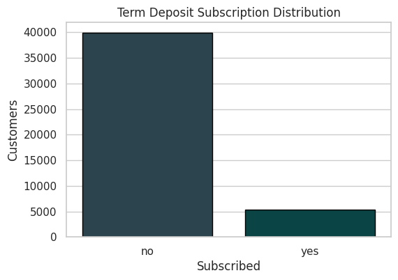
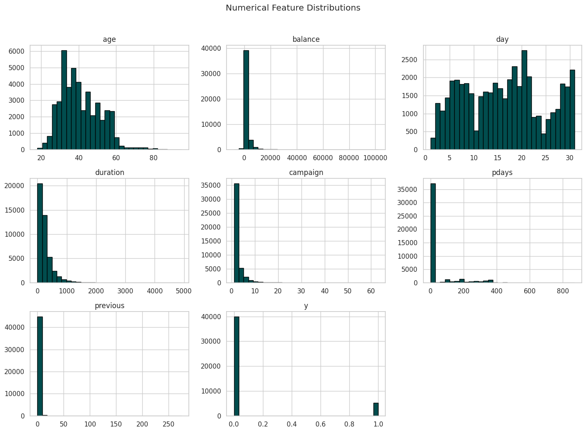
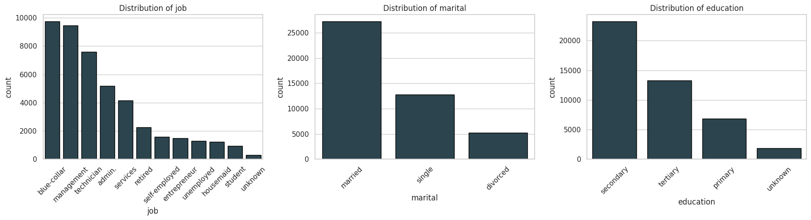
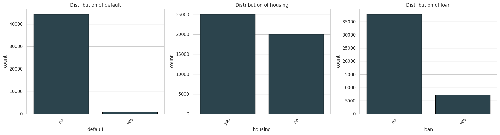
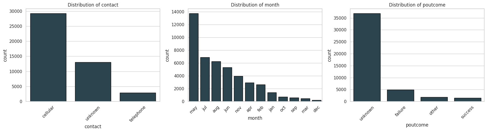
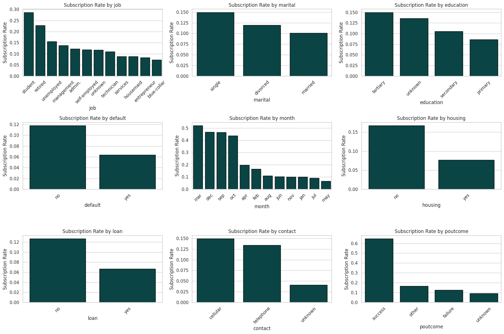
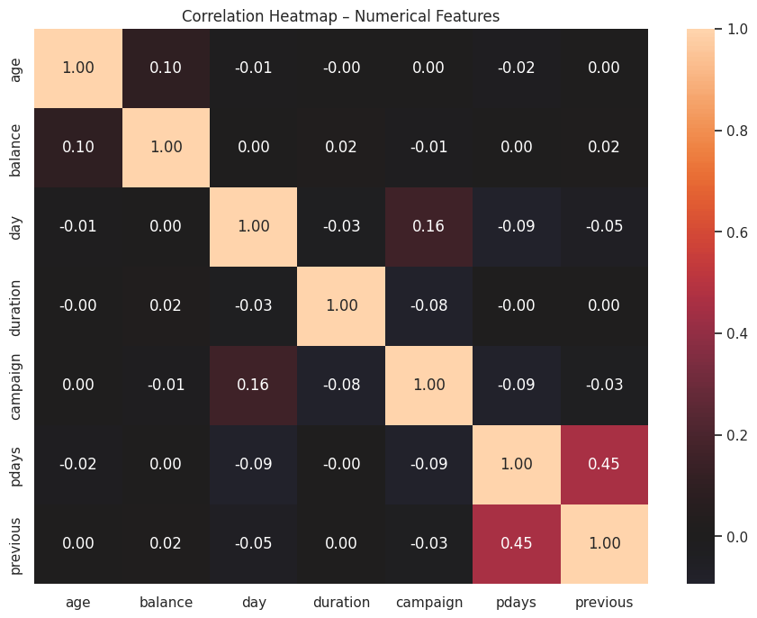
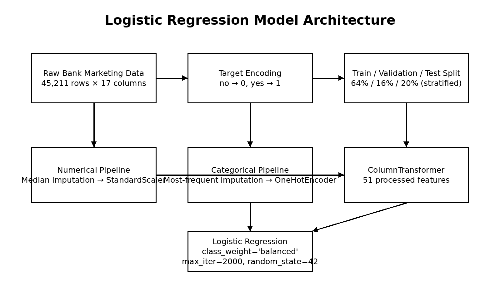
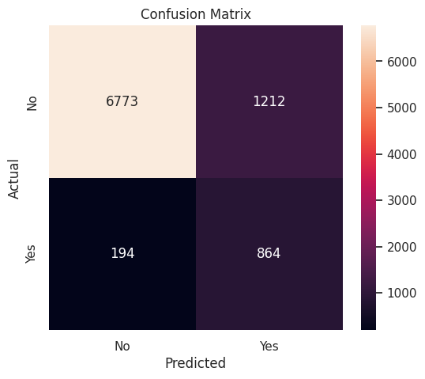
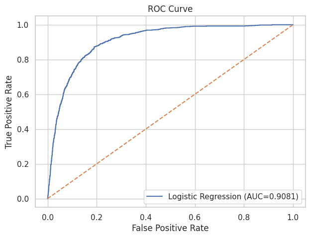

# Bank Marketing – Logistic Regression

## 1. Project Overview

This project builds a **Logistic Regression** classification model to predict whether a bank customer will subscribe to a **term deposit** (`yes`) or not (`no`) using the Bank Marketing dataset.

The accompanying notebook, `Bank_Marketing.ipynb`, implements the complete workflow:

1. Load and inspect the dataset.
2. Perform exploratory data analysis (EDA).
3. Check missing, unknown, and duplicate values.
4. Prepare the target and feature variables.
5. Split the data into training, validation, and test sets.
6. Build a preprocessing pipeline for numerical and categorical features.
7. Train a class-balanced Logistic Regression model.
8. Evaluate the model using multiple classification metrics.
9. Interpret the learned coefficients.
10. Demonstrate a prediction for a new customer.

> **Notebook source:** `Bank_Marketing.ipynb`

---

## 2. Problem Statement

A banking institution wants to identify customers who are likely to subscribe to a term deposit based on demographic, account, and campaign-related information.

This is a **binary classification** problem:

- `0` / `no` → customer does not subscribe
- `1` / `yes` → customer subscribes

The objective is not simply to maximize accuracy, but to build a model that can distinguish customers who are likely to subscribe from those who are not.

---

## 3. Dataset

The notebook loads the `bank-full.csv` dataset using a semicolon (`;`) separator.

### Dataset size

- **Rows:** 45,211
- **Columns:** 17
- **Features:** 16
- **Target:** `y`

### Variables

| Variable | Type | Description in the notebook |
|---|---|---|
| `age` | Numerical | Customer age |
| `job` | Categorical | Type of job |
| `marital` | Categorical | Marital status |
| `education` | Categorical | Education level |
| `default` | Categorical | Credit in default |
| `balance` | Numerical | Account balance |
| `housing` | Categorical | Housing loan status |
| `loan` | Categorical | Personal loan status |
| `contact` | Categorical | Contact communication type |
| `day` | Numerical | Day of contact |
| `month` | Categorical | Month of contact |
| `duration` | Numerical | Contact duration |
| `campaign` | Numerical | Number of contacts during the campaign |
| `pdays` | Numerical | Days since previous campaign contact |
| `previous` | Numerical | Number of contacts before the current campaign |
| `poutcome` | Categorical | Outcome of the previous campaign |
| `y` | Target | Term-deposit subscription |

The notebook reports 7 numerical columns and 10 object/categorical columns before target encoding.

---

## 4. Approach

The project follows a standard supervised machine-learning pipeline from raw data inspection through model interpretation and new-customer prediction.

```text
                 Bank Marketing Dataset
                          │
                          ▼
                  Data Inspection
                          │
          ┌───────────────┴───────────────┐
          ▼                               ▼
     Data Quality                     EDA
   Missing/Unknown                 Target & Feature
     Duplicates                    Distributions
          │                       Categorical Rates
          │                       Correlation
          └───────────────┬───────────────┘
                          ▼
                  Target Encoding
                    no → 0
                    yes → 1
                          │
                          ▼
              Stratified Train/Test Split
                    80% / 20%
                          │
                          ▼
                 Preprocessing Pipeline
             ┌────────────┴────────────┐
             ▼                         ▼
      Numerical Features       Categorical Features
      Median Imputation        Most-Frequent Imputation
      StandardScaler           One-Hot Encoding
             │                         │
             └────────────┬────────────┘
                          ▼
                 Logistic Regression
                class_weight="balanced"
                          │
                          ▼
                Probability of "Yes"
                          │
                          ▼
             Subscription Prediction
                     Yes / No
                          │
                          ▼
                    Evaluation
       Accuracy • Precision • Recall • F1
              ROC-AUC • Confusion Matrix
                          │
                          ▼
               Coefficient Interpretation
                          │
                          ▼
                 New Customer Prediction
```

The notebook implements this workflow using a scikit-learn `Pipeline` and `ColumnTransformer`, ensuring that preprocessing and prediction remain connected and that the same transformations are applied consistently to training, test, and new-customer data.

> **Note:** The notebook actually creates an 80% development set and a 20% test set, then divides the development set into training and validation data. The final row counts are 28,934 training, 7,234 validation, and 9,043 test observations.

## 5. Methodology

### 5.1 Data loading
The notebook reads:
```python
pd.read_csv(DATA_PATH, sep=";")
```

The loaded dataset contains 45,211 observations and 17 columns.

### 5.2 Data quality checks
The notebook checks:
- dataset dimensions
- data types
- statistical summary
- actual missing values
- `"unknown"` categorical values
- duplicate rows
- the special value `pdays = -1`

#### Findings
- There are **0 actual missing values** in all columns.
- There are **0 duplicate rows**.
- `"unknown"` occurs in several categorical variables.
- `poutcome` contains 36,959 `"unknown"` values.
- `contact` contains 13,020 `"unknown"` values.
- `education` contains 1,857 `"unknown"` values.
- `job` contains 288 `"unknown"` values.
- `pdays = -1` occurs for 36,954 observations, representing **81.74%** of the dataset.

The notebook keeps these categorical values rather than deleting the corresponding observations.

### 5.3 Exploratory Data Analysis
The notebook examines the target distribution, numerical feature distributions, categorical feature distributions, subscription rates across categorical variables, and correlations among numerical features.

The target is highly imbalanced:
- `no`: 39,922 (**88.3%**)
- `yes`: 5,289 (**11.7%**)

Because of this imbalance, the analysis considers precision, recall, F1-score, and ROC-AUC in addition to accuracy.

### 5.4 Target encoding
The target is converted from text to binary:
```python
df["y"] = df["y"].map({"no": 0, "yes": 1}).astype(int)
```

Therefore:
- `no` → `0`
- `yes` → `1`

### 5.5 Stratified splitting
The notebook first creates an 80% development set and a 20% test set, then splits the development set into training and validation data.

Final sizes:
- Training: **28,934**
- Validation: **7,234**
- Test: **9,043**

The split is stratified, preserving the subscription rate across datasets:
- Training: **0.1170**
- Validation: **0.1169**
- Test: **0.1170**

### 5.6 Preprocessing
A `ColumnTransformer` applies separate transformations to numerical and categorical variables.

**Numerical features**
1. Median imputation
2. StandardScaler

**Categorical features**
1. Most-frequent imputation
2. One-hot encoding with `handle_unknown="ignore"`

The preprocessing transforms the 16 original predictors into **51 model-ready features**.

### 5.7 Model training
The final estimator is a scikit-learn `Pipeline` containing the preprocessing transformer and Logistic Regression classifier.

```python
LogisticRegression(
    max_iter=2000,
    class_weight="balanced",
    random_state=42
)
```

`class_weight="balanced"` is used because only 11.7% of observations belong to the positive subscription class.

### 5.8 Evaluation
The model generates both class predictions and positive-class probabilities:
```python
y_pred = model.predict(X_test)
y_probability = model.predict_proba(X_test)[:, 1]
```

Evaluation includes:
- Accuracy
- Precision
- Recall
- F1-score
- ROC-AUC
- Classification report
- Confusion matrix
- ROC curve

### 5.9 Coefficient interpretation
Because Logistic Regression is coefficient-based, the learned coefficients are extracted and examined. Positive coefficients increase the model's log-odds of subscription, while negative coefficients decrease them, holding the other processed features constant.

### 5.10 New-customer prediction
Finally, the notebook demonstrates inference on a hypothetical customer and reports both the predicted class and estimated subscription probability.

---


### 5.1 Data loading

The notebook reads:

```python
pd.read_csv(DATA_PATH, sep=";")
```

The loaded dataset contains 45,211 observations and 17 columns.

### 5.2 Data quality checks

The notebook checks:

- dataset dimensions
- data types
- statistical summary
- actual missing values
- `"unknown"` categorical values
- duplicate rows
- the special value `pdays = -1`

#### Findings

- There are **0 actual missing values** in all columns.
- There are **0 duplicate rows**.
- `"unknown"` occurs in several categorical variables.
- `poutcome` contains 36,959 `"unknown"` values.
- `contact` contains 13,020 `"unknown"` values.
- `education` contains 1,857 `"unknown"` values.
- `job` contains 288 `"unknown"` values.
- `pdays = -1` occurs for 36,954 observations, representing **81.74%** of the dataset.

The notebook keeps these categorical values rather than deleting the corresponding observations.

---

## 6. Exploratory Data Analysis

The notebook performs several EDA steps.

### 6.1 Target distribution

The target is highly imbalanced:

| Target | Count | Percentage |
|---|---:|---:|
| `no` | 39,922 | 88.3% |
| `yes` | 5,289 | 11.7% |

This imbalance is important because a model could obtain high accuracy by favoring the majority class. Therefore, the notebook uses additional metrics such as precision, recall, F1-score, and ROC-AUC.



### 6.2 Numerical feature distributions

Histograms are generated for the numerical variables to inspect their distributions.



### 6.3 Categorical feature distributions

The notebook visualizes the distributions of categorical variables in groups of three.







### 6.4 Subscription rate by categorical features

The notebook calculates the proportion of subscribers within categories of:

- job
- marital status
- education
- default
- month
- housing
- loan
- contact
- previous campaign outcome



### 6.5 Correlation analysis

A correlation heatmap is generated for the numerical features.



---

## 7. Data Preparation

### 7.1 Target encoding

The target is converted from text to binary:

```python
df["y"] = df["y"].map({"no": 0, "yes": 1}).astype(int)
```

Therefore:

- `no` → `0`
- `yes` → `1`

### 7.2 Feature and target separation

The target `y` is removed from `X`, while `y` becomes the prediction target.

```python
X = df.drop("y", axis=1)
y = df["y"]
```

The resulting feature matrix contains **16 input features**.

### 7.3 Train / validation / test split

The notebook first creates an 80% development set and a 20% test set, then splits the development set into training and validation data.

Final sizes:

| Dataset | Rows |
|---|---:|
| Training | 28,934 |
| Validation | 7,234 |
| Test | 9,043 |

The split is **stratified**, preserving the subscription rate across the datasets.

Target rates reported by the notebook:

- Training: **0.1170**
- Validation: **0.1169**
- Test: **0.1170**

This indicates that the class distribution was maintained consistently across the splits.

---

## 8. Preprocessing Methodology

The notebook uses a `ColumnTransformer` with separate pipelines for numerical and categorical variables.

### Numerical pipeline

```text
Numerical features
       ↓
Median imputation
       ↓
StandardScaler
```

### Categorical pipeline

```text
Categorical features
       ↓
Most-frequent imputation
       ↓
OneHotEncoder(handle_unknown="ignore")
```

The preprocessing produces **51 transformed features** from the original 16 input features.

The same fitted preprocessing logic is used for training, validation, testing, and new-customer prediction.

---

## 9. Model Architecture

The model is implemented as a scikit-learn `Pipeline`.

```text
                 INPUT
                   │
          16 original features
                   │
             ┌─────┴─────┐
             │           │
       Numerical      Categorical
        features        features
             │           │
     Median Imputer  Most-Frequent
             │         Imputer
             │           │
       StandardScaler  OneHotEncoder
             │           │
             └─────┬─────┘
                   │
          ColumnTransformer
                   │
          51 processed features
                   │
          Logistic Regression
       class_weight = "balanced"
            max_iter = 2000
                   │
          ┌────────┴────────┐
          │                 │
     Class prediction   Probability
       0 / 1             P(y=1)
```



### Logistic Regression configuration

The notebook uses:

```python
LogisticRegression(
    max_iter=2000,
    class_weight="balanced",
    random_state=42
)
```

The use of `class_weight="balanced"` is particularly relevant because only 11.7% of observations belong to the positive class.

No neural network or tree-based model is used; the requested model is Logistic Regression.

---

## 10. Model Training

The final estimator is:

```python
model = Pipeline([
    ("preprocessor", preprocessor),
    ("classifier", LogisticRegression(
        max_iter=2000,
        class_weight="balanced",
        random_state=RANDOM_STATE
    ))
])
```

The model is then fitted on the training data:

```python
model.fit(X_train, y_train)
```

The notebook reports:

```text
Model trained successfully.
```

---

## 11. Model Evaluation

Predictions and positive-class probabilities are generated using:

```python
y_pred = model.predict(X_test)
y_probability = model.predict_proba(X_test)[:, 1]
```

The notebook evaluates the model using:

- Accuracy
- Precision
- Recall
- F1-score
- ROC-AUC
- Classification report
- Confusion matrix
- ROC curve

### Test-set performance

| Metric | Score |
|---|---:|
| Accuracy | **0.8445** |
| Precision | **0.4162** |
| Recall | **0.8166** |
| F1-score | **0.5514** |
| ROC-AUC | **0.9081** |

### Interpretation

The most important observation is the difference between precision and recall for the positive `Subscription` class:

- **Recall = 0.8166:** the model identifies a large proportion of actual subscribers.
- **Precision = 0.4162:** a considerable number of customers predicted as subscribers are actually non-subscribers.
- **F1-score = 0.5514:** reflects the trade-off between precision and recall.
- **ROC-AUC = 0.9081:** indicates strong ranking/discrimination performance on the test set.

Because the dataset is imbalanced, accuracy alone would not adequately describe the model's behavior.

---

## 12. Classification Report

The notebook reports:

| Class | Precision | Recall | F1-score | Support |
|---|---:|---:|---:|---:|
| No Subscription | 0.97 | 0.85 | 0.91 | 7,985 |
| Subscription | 0.42 | 0.82 | 0.55 | 1,058 |
| Overall Accuracy | | | **0.84** | 9,043 |

The positive class is the more difficult class to predict, but the model achieves substantially higher recall for it than a majority-class-oriented model would typically provide.

---

## 13. Confusion Matrix

The notebook generates a confusion matrix to show the counts of:

- true negatives
- false positives
- false negatives
- true positives



This visualization complements precision and recall by showing the actual classification outcomes.

---

## 14. ROC Curve

The ROC curve evaluates the model over different classification thresholds.

The notebook reports:

**ROC-AUC = 0.9081**



The ROC-AUC score is one of the strongest reported metrics in the notebook and provides a threshold-independent view of the model's ability to rank positive cases above negative cases.

---

## 15. Model Interpretation

Because Logistic Regression is coefficient-based, the notebook extracts the learned coefficients after training.

The 15 features with the largest absolute coefficients are:

| Feature | Coefficient |
|---|---:|
| `poutcome_success` | +1.798549 |
| `month_mar` | +1.731391 |
| `duration` | +1.533935 |
| `month_jan` | -1.410906 |
| `month_oct` | +1.194704 |
| `month_jul` | -1.065486 |
| `contact_unknown` | -1.051738 |
| `month_sep` | +0.973201 |
| `month_nov` | -0.972700 |
| `month_dec` | +0.832707 |
| `month_aug` | -0.821255 |
| `poutcome_unknown` | -0.779803 |
| `month_may` | -0.738112 |
| `job_student` | +0.705988 |
| `poutcome_failure` | -0.624904 |

### How to read the coefficients

- A **positive coefficient** increases the model's log-odds of predicting subscription, holding the other processed features constant.
- A **negative coefficient** decreases those log-odds.
- Larger absolute values indicate a stronger contribution within the fitted Logistic Regression model.

The coefficients should be interpreted in the context of one-hot encoded categories and standardized numerical features.

---

## 16. New Customer Prediction

The notebook demonstrates prediction for a hypothetical customer with:

- Age: 35
- Job: management
- Marital status: married
- Education: tertiary
- Default: no
- Balance: 1500
- Housing: yes
- Loan: no
- Contact: cellular
- Day: 10
- Month: may
- Duration: 300
- Campaign: 1
- `pdays`: -1
- Previous contacts: 0
- Previous outcome: unknown

The model produces:

```text
Predicted class: No
Probability of subscription: 0.3230
```

Thus, for this example, the model predicts **No subscription**, with an estimated subscription probability of **32.30%**.

---

## 17. Key Findings

1. **The dataset is strongly imbalanced.**  
   Only 11.7% of customers subscribed, while 88.3% did not.

2. **There are no actual missing values or duplicate rows.**  
   However, `"unknown"` is present in several categorical variables.

3. **`pdays = -1` is very common.**  
   It occurs in 81.74% of the observations and was retained as a numerical value in the notebook's modeling pipeline.

4. **The preprocessing converts the 16 original predictors into 51 model-ready features.**

5. **Class balancing is explicitly used.**  
   `class_weight="balanced"` helps the Logistic Regression model pay greater attention to the minority subscription class.

6. **The model has strong recall for subscribers.**  
   The test-set recall for the positive class is 0.8166.

7. **Precision is considerably lower than recall.**  
   With precision of 0.4162, the model identifies many potential subscribers but also produces a meaningful number of false positives.

8. **ROC-AUC is strong at 0.9081.**  
   This suggests good discriminatory/ranking performance on the test set.

9. **The model is interpretable.**  
   Logistic Regression coefficients provide a direct way to inspect which encoded features are associated with higher or lower predicted subscription likelihood.

---

## 19. Future Improvements

The current Logistic Regression model provides an interpretable and useful baseline, but the project could be improved in several ways.

### 19.1 Hyperparameter tuning
Perform systematic hyperparameter optimization using techniques such as Grid Search or Randomized Search. Parameters such as regularization strength (`C`), solver, and penalty could be tuned using stratified cross-validation.

### 19.2 Compare alternative models
Although Logistic Regression is the required model, comparing it with models such as Decision Trees, Random Forest, Gradient Boosting, XGBoost, or other suitable classifiers could determine whether nonlinear relationships improve predictive performance.

### 19.3 Optimize the classification threshold
The default 0.50 probability threshold does not necessarily represent the best business decision. Since the model has relatively high recall but lower precision, threshold tuning could be used to achieve a more appropriate precision-recall trade-off based on the bank's campaign objectives.

### 19.4 Handle `pdays = -1` more explicitly
The value `pdays = -1` represents customers who were not previously contacted. Rather than treating it only as a numerical value, future versions could create an additional indicator such as `previously_contacted` and transform or otherwise represent the `pdays` feature more explicitly.

### 19.5 Investigate `"unknown"` categories
The notebook retains `"unknown"` values in categorical variables. Future analysis could investigate whether these values represent meaningful customer/campaign states, missing information, or data-collection behavior and determine the most appropriate treatment.

### 19.6 Feature engineering
Additional domain-informed features could be created, for example:
- whether the customer has any previous campaign contact
- contact-frequency indicators
- grouped age or balance categories
- campaign intensity measures
- interactions between selected campaign and customer attributes

Any engineered features should be evaluated carefully to avoid introducing leakage.

### 19.7 Cross-validation and robustness testing
Instead of relying primarily on one train/validation/test split, repeated stratified cross-validation could provide a more robust estimate of model performance and variability.

### 19.8 Probability calibration
Because the model outputs subscription probabilities, calibration analysis could determine whether predicted probabilities correspond well to observed subscription frequencies. Calibrated probabilities may be more useful for campaign prioritization.

### 19.9 Business-focused evaluation
Future work could evaluate the model using business metrics such as:
- expected campaign cost
- expected conversion value
- lift and gain
- precision among the top-ranked customers
- profit or return on investment at different contact volumes

This would connect model performance more directly to the bank's marketing objective.

### 19.10 Model monitoring and governance
For deployment, the project should include monitoring for data drift, changes in customer behavior, model performance degradation, fairness considerations, and reproducibility. Predictions should be used with appropriate banking governance and human/business oversight rather than as an automatic decision mechanism.

---

## 20. Limitations and Considerations

The following points are important when interpreting the notebook results:

- The notebook focuses on **one Logistic Regression model** and does not compare it with other algorithms.
- No hyperparameter-search procedure is shown.
- The reported metrics are based on the test split generated with `random_state=42`.
- The positive class has substantially lower support than the negative class, so precision, recall, F1-score, and ROC-AUC are more informative than accuracy alone.
- The notebook uses `class_weight="balanced"`, which affects the classification behavior and should be retained when reproducing the reported results.
- The example prediction is a demonstration and should not be treated as a real banking decision without additional validation, governance, and business rules.
- The notebook's preprocessing and model are tightly connected through a scikit-learn pipeline, which is important for consistent inference.

---

## 21. Project Structure

The recommended project structure is:

```text
Bank_Marketing_Project/
│
├── Bank_Marketing.ipynb
├── README.md
│
└── images/
    ├── 01_target_distribution.png
    ├── 02_numerical_feature_distributions.png
    ├── 03_categorical_distributions_1.png
    ├── 04_categorical_distributions_2.png
    ├── 05_categorical_distributions_3.png
    ├── 06_subscription_rates_by_categorical_features.png
    ├── 07_correlation_heatmap.png
    ├── 08_confusion_matrix.png
    ├── 09_roc_curve.png
    └── 10_model_architecture.png
```

Keeping the figures in a dedicated `images/` directory keeps the README clean and makes the project easier to publish on GitHub or another repository.

---

## 22. Reproducing the Notebook

The notebook is written for Python/Google Colab and imports:

- NumPy
- Pandas
- Matplotlib
- Seaborn
- scikit-learn

The notebook initially mounts Google Drive and expects the dataset at:

```text
/content/drive/MyDrive/NN Assignment/Bank/bank-data/bank-full.csv
```

If running locally, update `DATA_PATH` to the location of `bank-full.csv`.

The notebook should then be executed from top to bottom so that the dataset, preprocessing pipeline, model, evaluation objects, and new-customer prediction are created in the expected order.

---

## 23. Conclusion

The notebook implements an end-to-end **Logistic Regression solution for bank term-deposit subscription prediction**.

The workflow combines data-quality analysis, exploratory visualization, stratified data splitting, preprocessing of mixed numerical/categorical variables, class-balanced Logistic Regression, and multiple evaluation metrics.

The final model achieves:

- **84.45% accuracy**
- **41.62% precision**
- **81.66% recall**
- **55.14% F1-score**
- **90.81% ROC-AUC**

The results show that the model is particularly effective at identifying potential subscribers, as reflected by its high recall and strong ROC-AUC, while the lower precision indicates that some predicted subscribers are false positives.

Overall, the notebook provides a reproducible and interpretable baseline for the stated banking classification problem.
